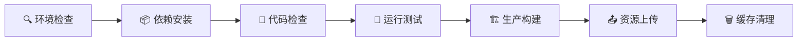
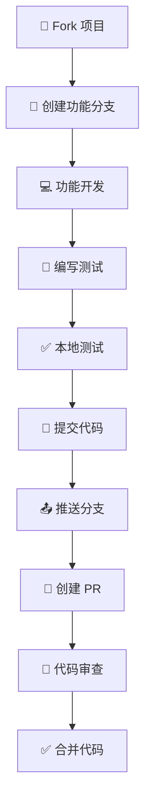

🌟 元宇宙平台前端系统
**🚀 构建未来的数字世界体验**

---

## 📖 项目概述

这是一个基于 **Vue.js 3** 的现代化前端应用，采用最新的 Web 技术栈构建的**元宇宙综合平台**。该平台集成了AI助手、虚拟世界、社交互动、用户管理等多个功能模块，为用户提供沉浸式的元宇宙体验。

### 🎯 核心特性

- 🤖 **智能AI助手** - 多模态AI交互体验
- 🌐 **虚拟世界** - 沉浸式3D元宇宙环境
- 👥 **社交互动** - 实时多人协作与交流
- 🛡️ **安全可靠** - 端到端加密与隐私保护
- 📱 **响应式设计** - 全设备完美适配
- 🚀 **高性能** - 优化的加载速度与用户体验

---

## 🛠 技术栈

### 🔧 核心框架
| 技术 | 版本 | 描述 |
|------|------|------|
| **Vue.js** | 3.0+ | 渐进式 JavaScript 框架 |
| **Vite** | 5.0+ | 下一代前端构建工具 |
| **Vue Router** | 4.0+ | 官方路由管理器 |
| **Pinia** | 2.0+ | Vue 状态管理库 |

### 🎨 UI 和样式
| 技术 | 版本 | 描述 |
|------|------|------|
| **TailwindCSS** | 3.0+ | 实用程序优先的 CSS 框架 |
| **SCSS/Sass** | Latest | CSS 预处理器 |
| **Three.js** | Latest | 3D 图形库（用于背景效果） |

### 🔨 开发工具
| 工具 | 描述 |
|------|------|
| **ESLint** | 代码质量工具 |
| **PostCSS** | CSS 后处理器 |
| **npm** | 包管理器 |

---

## 📁 项目架构

```
frontend/
├── 📁 public/                     # 静态资源
├── 📁 src/
│   ├── 📁 api/                   # API 接口层
│   │   ├── 📁 modules/           # 按模块分类的 API
│   │   │   ├── 🤖 ai.js         # AI 相关接口
│   │   │   ├── 🔐 auth.js       # 认证接口
│   │   │   ├── 🌐 metaverse.js  # 元宇宙接口
│   │   │   └── 👤 user.js       # 用户接口
│   │   ├── 📁 utils/            # API 工具类
│   │   │   ├── 🔒 crypto.js     # 加密工具
│   │   │   └── ⚙️ cryptoConfig.js # 加密配置
│   │   ├── 🌐 axios.js          # Axios 基础配置
│   │   ├── 🔐 secureAxios.js    # 安全加密的 Axios 实例
│   │   └── 📋 index.js          # API 统一导出
│   │
│   ├── 📁 assets/               # 静态资源
│   │   ├── 📁 css/             # 全局样式
│   │   └── 📁 styles/          # SCSS 样式文件
│   │       ├── 📁 components/   # 组件样式
│   │       └── 📁 view/        # 页面样式
│   │
│   ├── 📁 components/          # Vue 组件
│   │   ├── 🤖 ai/             # AI 相关组件
│   │   ├── 🏗️ layout/         # 布局组件
│   │   ├── 📄 pages/          # 页面组件
│   │   └── 🎨 ui/             # UI 通用组件
│   │
│   ├── 📁 composables/        # 组合式函数
│   │   └── 🎮 useThreeBackground.js  # Three.js 背景效果
│   │
│   ├── 📁 router/             # 路由配置
│   │   └── 🗺️ index.js        # 路由定义
│   │
│   ├── 📁 server/             # 前端业务逻辑
│   │   └── 📁 view/           # 页面业务逻辑
│   │
│   ├── 📁 stores/             # 状态管理
│   │   ├── 🤖 ai.js          # AI 状态
│   │   └── 🔐 auth.js        # 认证状态
│   │
│   ├── 📁 views/              # 页面视图
│   │   ├── 👨‍💼 admin/         # 管理后台
│   │   ├── 🤖 ai/            # AI 功能页面
│   │   ├── 🔐 auth/          # 认证页面
│   │   ├── 🌐 metaverse/     # 元宇宙页面
│   │   └── 👤 user/          # 用户页面
│   │
│   ├── 🏠 App.vue            # 根组件
│   └── ⚡ main.js            # 应用入口
│
├── 📦 package.json           # 项目配置
├── ⚡ vite.config.js        # Vite 配置
├── 🎨 tailwind.config.js    # TailwindCSS 配置
└── 🔧 postcss.config.js     # PostCSS 配置
```

---

## 🚀 功能模块详解

### 1. 🔐 认证系统 (Authentication System)

<details>
<summary>点击展开详细信息</summary>

#### 核心功能
- ✅ **用户登录/注册** - 完整的账户管理系统
- 🔄 **密码重置** - 安全的密码恢复流程
- 🛡️ **多因素认证** - 增强账户安全性
- 🌐 **社交登录** - 支持第三方平台登录

#### 技术实现
- **JWT 令牌认证** - 无状态安全认证
- **自动令牌刷新** - 无感知用户体验
- **密码加密存储** - BCrypt 安全哈希
- **会话管理** - 智能会话控制

#### 相关文件
```
📁 src/views/auth/          # 认证页面组件
├── 🔐 LoginView.vue       # 登录页面
├── 📝 RegisterView.vue    # 注册页面
├── 🔑 ForgotPasswordView.vue # 忘记密码
└── 🔄 ResetPasswordView.vue  # 重置密码

📁 src/stores/             # 状态管理
└── 🔐 auth.js            # 认证状态管理

📁 src/api/modules/        # API 接口
└── 🔐 auth.js            # 认证相关 API
```

</details>

### 2. 🤖 AI 助手模块 (AI Assistant System)

<details>
<summary>点击展开详细信息</summary>

#### 核心功能
- 💬 **AI 聊天** - 智能对话系统，支持上下文理解
- 👥 **AI 伴侣** - 个性化AI助手，情感化交互
- 🎤 **语音实验室** - 语音合成与识别功能
- 🐾 **宠物助手** - 虚拟宠物AI，陪伴式体验

#### 技术特性
- **多模态交互** - 文本、语音、图像多种交互方式
- **情感分析** - AI情感理解与响应
- **个性化学习** - 用户偏好自适应
- **实时响应** - 低延迟对话体验

#### 相关文件
```
📁 src/views/ai/           # AI 功能页面
├── 💬 AIChatView.vue     # AI 聊天界面
├── 👥 AICompanionView.vue # AI 伴侣页面
└── 🎤 VoiceLabView.vue   # 语音实验室

📁 src/components/ai/      # AI 组件
├── 🐾 PetAssistant.vue   # 宠物助手组件
└── 💭 FloatingAIAssistant.vue # 浮动AI助手

📁 src/stores/            # 状态管理
└── 🤖 ai.js             # AI 状态管理

📁 src/api/modules/       # API 接口
└── 🤖 ai.js             # AI 相关 API
```

</details>

### 3. 🌐 元宇宙模块 (Metaverse Platform)

<details>
<summary>点击展开详细信息</summary>

#### 核心功能
- 🌍 **虚拟世界** - 沉浸式3D虚拟环境
- 👤 **数字身份** - 个性化虚拟形象系统
- 💎 **虚拟资产** - NFT和数字藏品管理
- 🎮 **空间交互** - 多人实时3D交互

#### 技术实现
- **WebGL渲染** - 高性能3D图形渲染
- **实时同步** - WebSocket多人协作
- **区块链集成** - NFT资产管理
- **物理引擎** - 真实物理交互

#### 相关文件
```
📁 src/views/metaverse/    # 元宇宙页面
└── 🌐 MetaverseView.vue  # 元宇宙主界面

📁 src/api/modules/       # API 接口
└── 🌐 metaverse.js      # 元宇宙 API

📁 src/assets/styles/view/metaverse/
└── 🎨 metaverse.scss    # 元宇宙样式
```

</details>

### 4. 👤 用户管理系统 (User Management)

<details>
<summary>点击展开详细信息</summary>

#### 核心功能
- 📋 **个人资料** - 完整的用户信息管理
- 👫 **好友系统** - 社交关系网络管理
- ⚙️ **设置中心** - 个性化配置选项
- 🔒 **隐私控制** - 细粒度隐私设置

#### 功能特性
- **实时状态** - 在线状态实时更新
- **社交互动** - 好友邀请、消息通知
- **数据同步** - 跨设备数据同步
- **隐私保护** - 分级隐私控制

#### 相关文件
```
📁 src/views/user/         # 用户页面
├── 👤 ProfileView.vue    # 个人资料页面
├── 👫 FriendsView.vue    # 好友管理页面
├── ⚙️ SettingsView.vue   # 设置页面
└── 🏗️ UserLayout.vue    # 用户布局组件

📁 src/api/modules/       # API 接口
└── 👤 user.js           # 用户相关 API
```

</details>

### 5. 👨‍💼 管理后台系统 (Admin Dashboard)

<details>
<summary>点击展开详细信息</summary>

#### 核心功能
- 👥 **用户管理** - 批量用户操作与管理
- 📊 **数据分析** - 平台数据统计与可视化
- 🔍 **内容审核** - 智能内容管理系统
- 📈 **系统监控** - 实时运营数据展示

#### 管理特性
- **权限控制** - 基于角色的访问控制
- **操作日志** - 完整的操作审计
- **数据导出** - 多格式数据导出
- **实时监控** - 系统性能实时监控

#### 相关文件
```
📁 src/views/admin/        # 管理后台页面
├── 👨‍💼 AdminLayout.vue    # 管理后台布局
├── 📊 DashboardView.vue   # 仪表板页面
├── 📁 analytics/         # 数据分析模块
│   └── 📈 AnalyticsView.vue # 分析页面
└── 📁 users/             # 用户管理模块
    ├── 👥 UsersView.vue   # 用户列表页面
    └── 👤 UserDetailView.vue # 用户详情页面
```

</details>

### 6. 🎨 通用组件系统 (Common Components)

<details>
<summary>点击展开详细信息</summary>

#### 布局组件
- 🧭 **响应式导航栏** - 自适应导航系统
- 🦶 **全局页脚** - 统一页脚组件
- 🔄 **加载动画** - 优雅的加载效果
- 💭 **浮动助手** - 智能悬浮AI助手

#### 设计特性
- **组件化架构** - 高度可复用组件
- **主题系统** - 动态主题切换
- **国际化** - 多语言支持
- **无障碍设计** - WCAG标准兼容

#### 相关文件
```
📁 src/components/        # 通用组件
├── 📁 layout/           # 布局组件
│   ├── 🧭 AppNavbar.vue  # 导航栏组件
│   └── 🦶 AppFooter.vue  # 页脚组件
├── 📁 pages/            # 页面组件
│   ├── 📖 AboutView.vue  # 关于页面
│   ├── 👥 TeamView.vue   # 团队页面
│   ├── 📞 ContactView.vue # 联系页面
│   └── 🔒 PrivacyView.vue # 隐私政策
└── 📁 ui/               # UI组件
    ├── 🔄 LoadingSpinner.vue # 加载动画
    └── 💭 FloatingAIAssistant.vue # 浮动助手
```

</details>

---

## 🔧 开发环境配置

### 📋 前置要求

| 软件 | 版本要求 | 下载链接 |
|------|----------|----------|
| **Node.js** | >= 16.0.0 | [官方下载](https://nodejs.org/) |
| **npm** | >= 8.0.0 | 随 Node.js 安装 |
| **Git** | 最新版本 | [官方下载](https://git-scm.com/) |

### ⚡ 快速开始

```bash
# 1. 克隆项目
git clone [项目地址]
cd yuanyuzhou/frontend

# 2. 安装依赖
npm install

# 3. 启动开发服务器
npm run dev

# 4. 浏览器访问
# http://localhost:5173
```

### 🛠️ 常用命令

```bash
# 开发模式 (热重载)
npm run dev

# 生产构建
npm run build

# 预览生产构建
npm run preview

# 代码检查
npm run lint

# 代码格式化
npm run format

# 类型检查
npm run type-check
```

---

## 🌐 API 接口架构

### 🏗️ 架构设计原则

| 特性 | 描述 |
|------|------|
| **🧩 模块化设计** | 按功能模块组织 API 接口 |
| **🔐 安全加密** | AES-256-GCM 端到端加密 |
| **🛡️ 统一错误处理** | 标准化错误响应格式 |
| **🔄 请求拦截** | 自动添加认证头和重试机制 |

### 📡 API 模块说明

#### 🔐 认证模块 (auth.js)
```javascript
// 用户登录
POST /api/auth/login
{
  "email": "user@example.com",
  "password": "password123"
}

// 用户注册
POST /api/auth/register
{
  "username": "newuser",
  "email": "user@example.com",
  "password": "password123"
}

// 刷新令牌
POST /api/auth/refresh
{
  "refreshToken": "refresh_token_here"
}

// 用户登出
POST /api/auth/logout
```

#### 🤖 AI 模块 (ai.js)
```javascript
// AI 对话
POST /api/ai/chat
{
  "message": "你好，AI助手",
  "context": "previous_conversation"
}

// 语音合成
POST /api/ai/tts
{
  "text": "要转换的文本",
  "voice": "female",
  "speed": 1.0
}

// 语音识别
POST /api/ai/stt
{
  "audioData": "base64_audio_data",
  "language": "zh-CN"
}

// AI 伴侣交互
POST /api/ai/companion
{
  "action": "interact",
  "companionId": "companion_123"
}
```

#### 🌐 元宇宙模块 (metaverse.js)
```javascript
// 获取虚拟世界列表
GET /api/metaverse/worlds

// 创建虚拟空间
POST /api/metaverse/spaces
{
  "name": "我的虚拟空间",
  "type": "private",
  "settings": {}
}

// 虚拟资产管理
GET /api/metaverse/assets
POST /api/metaverse/assets
PUT /api/metaverse/assets/:id
DELETE /api/metaverse/assets/:id
```

#### 👤 用户模块 (user.js)
```javascript
// 获取用户信息
GET /api/user/profile

// 更新用户信息
PUT /api/user/profile
{
  "nickname": "新昵称",
  "avatar": "avatar_url"
}

// 好友管理
GET /api/user/friends
POST /api/user/friends/add
DELETE /api/user/friends/:friendId

// 用户设置
GET /api/user/settings
PUT /api/user/settings
{
  "theme": "dark",
  "language": "zh-CN"
}
```

---

## 🎨 样式系统架构

### 🎯 设计原则

| 原则 | 描述 |
|------|------|
| **📱 响应式设计** | 支持所有设备尺寸，移动优先 |
| **🌙 暗色模式** | 自动适配系统主题偏好 |
| **🧩 组件化样式** | 模块化 SCSS 架构设计 |
| **♿ 可访问性** | 符合 WCAG 2.1 AA 标准 |

### 🏗️ 样式架构

```
📁 src/assets/styles/
├── 📄 _variables.scss      # 🎨 全局变量定义
├── 📄 main.scss           # 🏠 主样式文件
├── 📄 variables.scss      # ⚙️ 变量配置
├── 📁 components/         # 🧩 组件样式
│   ├── 🧭 AppNavbar.scss   # 导航栏样式
│   ├── 🦶 AppFooter.scss   # 页脚样式
│   └── 📁 pages/          # 页面组件样式
│       └── 📖 AboutView.scss
└── 📁 view/              # 📄 页面样式
    ├── 📊 dashboard.scss   # 仪表板样式
    ├── 🏠 home.scss       # 首页样式
    ├── 📁 auth/           # 🔐 认证页面样式
    │   └── 🔐 auth.scss
    ├── 📁 ai/             # 🤖 AI 页面样式
    │   ├── 🎤 voice-lab.scss
    │   └── 💬 AIChatView.vue
    ├── 📁 admin/          # 👨‍💼 管理后台样式
    ├── 📁 metaverse/      # 🌐 元宇宙样式
    │   └── 🌐 metaverse.scss
    └── 📁 user/           # 👤 用户页面样式
        ├── 👤 profile.scss
        ├── 👫 friends.scss
        ├── ⚙️ settings.scss
        └── 🏗️ layout.scss
```

### 🎨 主题配置

```scss
// 主题变量示例
:root {
  // 🎨 主色调
  --primary-color: #667eea;
  --secondary-color: #764ba2;

  // 🌈 语义化颜色
  --success-color: #10b981;
  --warning-color: #f59e0b;
  --error-color: #ef4444;
  --info-color: #3b82f6;

  // 🌙 暗色模式
  --bg-primary: #ffffff;
  --bg-secondary: #f8fafc;
  --text-primary: #1f2937;
  --text-secondary: #6b7280;
}

[data-theme="dark"] {
  --bg-primary: #1f2937;
  --bg-secondary: #111827;
  --text-primary: #f9fafb;
  --text-secondary: #d1d5db;
}
```

---

## 🔐 安全特性

### 🛡️ 数据加密

| 特性 | 技术实现 |
|------|----------|
| **🔒 请求加密** | AES-256-GCM 端到端加密 |
| **🔓 响应解密** | 自动解密响应数据 |
| **🔑 密钥管理** | 安全的密钥交换机制 |
| **🔐 数据完整性** | HMAC 消息认证码 |

### 🔑 认证安全

```javascript
// JWT 令牌示例
{
  "accessToken": "eyJhbGciOiJIUzI1NiIsInR5cCI6IkpXVCJ9...",
  "refreshToken": "eyJhbGciOiJIUzI1NiIsInR5cCI6IkpXVCJ9...",
  "expiresIn": 3600,
  "tokenType": "Bearer"
}
```

| 特性 | 描述 |
|------|------|
| **🎫 JWT 令牌** | 无状态认证机制 |
| **🔄 自动刷新** | 令牌无感知续期 |
| **🛡️ CSRF 防护** | 跨站请求伪造防护 |
| **🔒 XSS 防护** | 跨站脚本攻击防护 |

### 🔒 隐私保护

- **📊 数据最小化** - 只收集必要的用户数据
- **🔐 本地存储加密** - 敏感数据加密存储
- **👤 用户控制** - 完整的隐私设置选项
- **📝 透明度报告** - 定期发布数据使用报告

---

## 📱 响应式设计

### 📐 断点设置

```scss
// 📱 移动设备
@media (max-width: 768px) {
  .container {
    padding: 1rem;
  }
}

// 📟 平板设备
@media (min-width: 769px) and (max-width: 1024px) {
  .container {
    padding: 2rem;
  }
}

// 🖥️ 桌面设备
@media (min-width: 1025px) {
  .container {
    padding: 3rem;
  }
}
```

### 🎯 适配特性

| 特性 | 实现方式 |
|------|----------|
| **📐 弹性布局** | Flexbox 和 CSS Grid |
| **📏 相对单位** | rem/em 单位系统 |
| **🖼️ 响应式图片** | srcset 和 picture 元素 |
| **👆 触摸优化** | 触摸友好的交互设计 |

---

## 🚀 性能优化策略

### ⚡ 代码分割

```javascript
// 路由懒加载示例
const routes = [
  {
    path: '/ai',
    component: () => import('@/views/ai/AIChatView.vue')
  },
  {
    path: '/metaverse',
    component: () => import('@/views/metaverse/MetaverseView.vue')
  }
]
```

### 🗜️ 资源优化

| 优化类型 | 技术实现 |
|----------|----------|
| **🖼️ 图片压缩** | WebP 格式 + 自动压缩 |
| **🎨 CSS 压缩** | PurgeCSS + Minification |
| **📦 JS 压缩** | Terser + Tree Shaking |
| **🗜️ Gzip 压缩** | 服务器端压缩配置 |

### 💾 缓存策略

```javascript
// Service Worker 缓存示例
const CACHE_NAME = 'metaverse-v1.0.0';
const urlsToCache = [
  '/',
  '/assets/css/main.css',
  '/assets/js/app.js'
];

self.addEventListener('install', (event) => {
  event.waitUntil(
    caches.open(CACHE_NAME)
      .then((cache) => cache.addAll(urlsToCache))
  );
});
```

---

## 🧪 测试策略

### 📋 测试类型

| 测试类型 | 工具 | 覆盖范围 |
|----------|------|----------|
| **🔬 单元测试** | Vitest + Vue Test Utils | 组件和函数 |
| **🔗 集成测试** | Testing Library | API 和状态管理 |
| **🎭 端到端测试** | Cypress | 完整用户流程 |
| **⚡ 性能测试** | Lighthouse CI | 页面加载性能 |

### 🏃‍♂️ 测试命令

```bash
# 运行所有测试
npm run test

# 运行单元测试
npm run test:unit

# 运行端到端测试
npm run test:e2e

# 生成测试覆盖率报告
npm run test:coverage

# 性能测试
npm run test:lighthouse
```

---

## 📚 开发规范

### 📝 代码规范

```javascript
// Vue 组件开发规范
<template>
  <!-- 📝 模板使用 kebab-case -->
  <div class="user-profile">
    <user-avatar :src="user.avatar" />
    <user-info :user="user" />
  </div>
</template>

<script setup>
// 📦 导入顺序：Vue API > 第三方库 > 本地模块
import { ref, computed, onMounted } from 'vue'
import { useRouter } from 'vue-router'
import { useUserStore } from '@/stores/user'

// 🎯 使用 TypeScript 类型注解
interface User {
  id: number
  name: string
  avatar: string
}

// 📊 响应式数据
const user = ref<User | null>(null)
const userStore = useUserStore()

// 💭 计算属性
const displayName = computed(() =>
  user.value?.name || '匿名用户'
)

// 🔄 生命周期
onMounted(async () => {
  user.value = await userStore.fetchCurrentUser()
})
</script>

<style scoped lang="scss">
/* 🎨 使用 BEM 命名规范 */
.user-profile {
  @apply flex items-center space-x-4;

  &__avatar {
    @apply w-12 h-12 rounded-full;
  }

  &__info {
    @apply flex-1;
  }
}
</style>
```

### 📋 提交规范

```bash
# 🎯 提交类型
feat: ✨ 新功能
fix: 🐛 修复问题
docs: 📚 文档更新
style: 💄 代码格式
refactor: ♻️ 代码重构
test: 🧪 测试相关
chore: 🔧 构建工具
perf: ⚡ 性能优化
ci: 👷 CI/CD 相关

# 📝 提交示例
git commit -m "feat: ✨ 添加AI语音识别功能

- 集成语音识别API
- 添加音频录制组件
- 实现实时语音转文字
- 优化语音识别准确率

Closes #123"
```

---

## 🔄 部署流程

### 🏗️ 构建步骤



### 🌍 环境配置

| 环境 | 分支 | 域名 | 描述 |
|------|------|------|------|
| **🧪 开发环境** | `develop` | `dev.example.com` | 本地开发服务器 |
| **🔬 测试环境** | `staging` | `staging.example.com` | 功能测试部署 |
| **🚀 生产环境** | `main` | `example.com` | 正式生产部署 |

### 📋 部署检查清单

- [ ] ✅ 代码通过 ESLint 检查
- [ ] 🧪 所有测试用例通过
- [ ] ⚡ 性能评分 > 90
- [ ] 🔒 安全扫描通过
- [ ] 📚 文档更新完成
- [ ] 🏷️ 版本标签创建

---

## 🤝 贡献指南

### 🔄 开发流程



### 📋 PR 检查清单

- [ ] 📝 提供清晰的 PR 描述
- [ ] 🧪 添加对应的测试用例
- [ ] 📚 更新相关文档
- [ ] ✅ 通过所有 CI 检查
- [ ] 🔍 无冲突需要解决
- [ ] 👥 获得至少一个审查通过

### 🎯 贡献类型

| 类型 | 描述 | 标签 |
|------|------|------|
| **🐛 Bug 修复** | 修复现有功能问题 | `bug` |
| **✨ 新功能** | 添加新的功能特性 | `enhancement` |
| **📚 文档改进** | 改进项目文档 | `documentation` |
| **🎨 UI/UX 优化** | 改进用户界面和体验 | `ui/ux` |
| **⚡ 性能优化** | 提升应用性能 | `performance` |

---

## 📞 技术支持

### 🔗 联系方式

| 渠道 | 链接 | 描述 |
|------|------|------|
| **📚 项目仓库** | [GitHub](https://github.com/example/metaverse) | 源代码和版本管理 |
| **🐛 问题反馈** | [Issues](https://github.com/example/metaverse/issues) | Bug 报告和功能请求 |
| **💬 技术讨论** | [Discussions](https://github.com/example/metaverse/discussions) | 技术交流和问题讨论 |
| **📧 邮件支持** | [tech@example.com](mailto:tech@example.com) | 技术支持邮箱 |

### 📖 学习资源

| 技术 | 官方文档 | 中文资源 |
|------|----------|----------|
| **Vue.js** | [vuejs.org](https://vuejs.org/) | [Vue.js 中文网](https://cn.vuejs.org/) |
| **Vite** | [vitejs.dev](https://vitejs.dev/) | [Vite 中文网](https://cn.vitejs.dev/) |
| **TailwindCSS** | [tailwindcss.com](https://tailwindcss.com/) | [TailwindCSS 中文网](https://www.tailwindcss.cn/) |
| **Three.js** | [threejs.org](https://threejs.org/) | [Three.js 中文网](http://www.hewebgl.com/article/articledir/1) |

---

## 📄 许可证

本项目采用 **MIT** 许可证，详见 [LICENSE](../LICENSE) 文件。

```
MIT License

Copyright (c) 2024 元宇宙平台

Permission is hereby granted, free of charge, to any person obtaining a copy
of this software and associated documentation files (the "Software"), to deal
in the Software without restriction, including without limitation the rights
to use, copy, modify, merge, publish, distribute, sublicense, and/or sell
copies of the Software...
```

---

## 🏆 团队成员

<div align="center">

### 💫 核心开发团队

| 角色 | 成员 | 联系方式 |
|------|------|----------|
| **👨‍💼 项目负责人** | @ProjectLead | 📧 lead@example.com |
| **🎨 前端架构师** | @FrontendArchitect | 📧 frontend@example.com |
| **🤖 AI 专家** | @AIExpert | 📧 ai@example.com |
| **🌐 元宇宙专家** | @MetaverseExpert | 📧 metaverse@example.com |

</div>

---

<div align="center">

## 🌟 致谢

感谢所有为这个项目做出贡献的开发者们！

**🚀 让我们一起构建未来的数字世界体验！**

---

[](https://github.com/example/metaverse)
[](https://github.com/example/metaverse/fork)
[](https://github.com/example)

**📅 最后更新时间：2024年05月**

